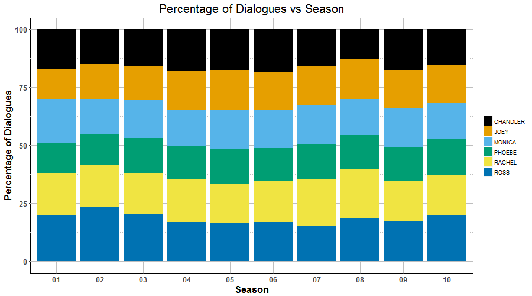
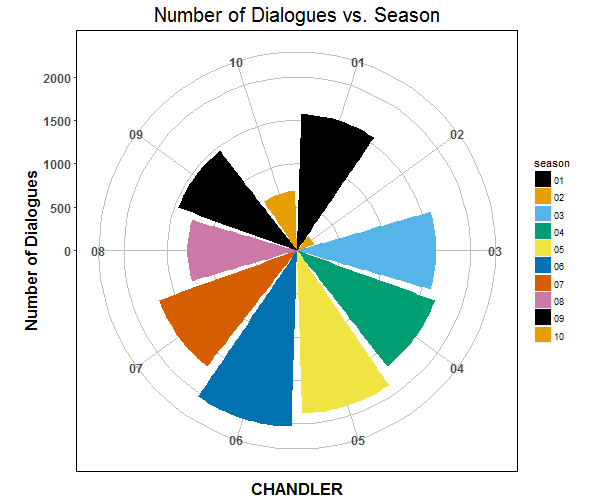
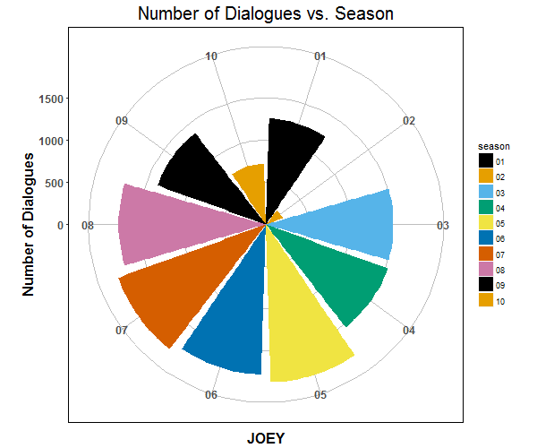
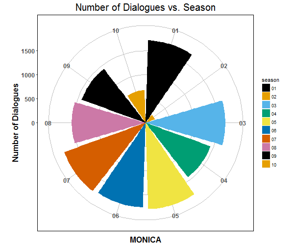
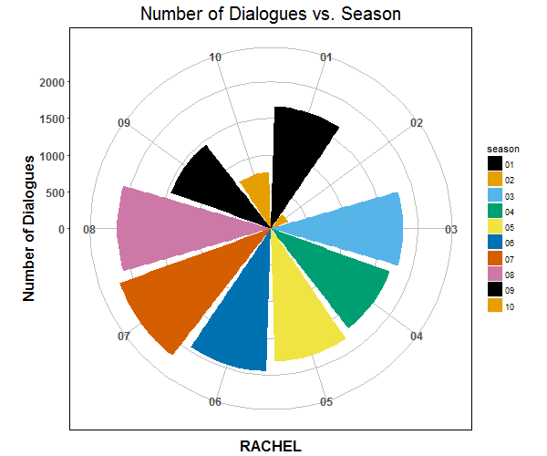
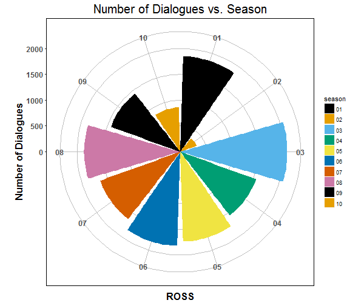

 

# The.One.with.the.Data!

The idea is to analyze and understand the contribution of all the Lead Characters of [F.R.I.E.N.D.S TV series (1994-2004)](https://en.wikipedia.org/wiki/Friends) in-terms of number of dialogues spoken by them.


Lead Characters/**The FRIENDS** in this TV series are **Chandler, Joey, Monica, Phoebe, Rachel** and **Ross**.

## Some notes on data scraping

Data is scraped from episode **transcipts** - `html` files. These transcripts can be downloaded from [my GitHub repo](https://github.com/puneeth019/F.R.I.E.N.D.S/tree/master/transcripts).

**R** code to extract data and create plots is [here](https://github.com/puneeth019/F.R.I.E.N.D.S/blob/master/scripts/the_one_with_the_data.R).

Once you extract and `tidy` the data, it looks like this...

```
> dialogues
# A tibble: 227 × 8
   Episode_Number CHANDLER  JOEY MONICA PHOEBE RACHEL  ROSS season
            <int>    <int> <int>  <int>  <int>  <int> <int>  <chr>
1               1       76    80    141     38     94    94     01
2               2       32    17     56     28     75   126     01
3               3       72    56    103     76     52    66     01
4               4       64    47     94     62     86    78     01
5               5       70    72     66     46     74    80     01
6               6      115    60     68     20     30    43     01
7               7       49    54     46     49     86   106     01
8               8       74    22     68     32     36    96     01
9               9       52    64     96     40     70    71     01
10             10       61    38     46     97     36    58     01
# ... with 217 more rows
```

## Observations

### Rachels talks a lot! :P

From the plot below, you can see the Number of dialogues(**#dialogues**) spoken in all **Ten Seasons** by each Lead-Character.


Overall, the writers maintained **#dialogues** by all characters to be close to each other's, with **Rachel** delivering the highest *(15,707)* and **Phoebe** the least*(12,443)*. **Chandler***(14,091)*, **Joey***(13,865)* & **Monica***(14,032)* are in the same league and **Rachel** & **Ross***(15174)* are in the other. I guess you can expect that **#dialogues** for **Phoebe** are the least. Phoebs is not the least favourite character though! :)

### *Number* of Dialogues versus Season

**Season 6** has the *highest* **#dialogues***(10,897)* out of all Ten seasons. And season 5 *(10,738)*, season 6 & season 7*(10,798)* have almost same **#dialogues**. Maybe the writers created relatively more content towards middle of the series.


And also it is obvious that something went wrong while extracting data for **Season 2** as **#dialogues** for this season*(1,416)* are pretty less compared with the rest. The [script](https://github.com/puneeth019/F.R.I.E.N.D.S/blob/master/scripts/the_one_with_the_data.R) has to be modified to extract accurate data for this season. And it's also worth to check the same for **Season 10** as well, because **#dialogues** for this season *(4,392)* doesn't compare well with the others.

### *Percentage* of Dialogues versus Season

From the plot below, you can see the **Percentage** of dialogues spoken by each characer in each Season.



Even from this plot it's clear that Phoebe has the least **#dialogues** in the series.

### Number of Dialogues by each Character in each season

 










The above plots show clear contribution of all the Lead-Characters **individually** towards each season.
And even from these plots, it's clear that more work might be needed to extract data from **Seasons 2 & 10**.
